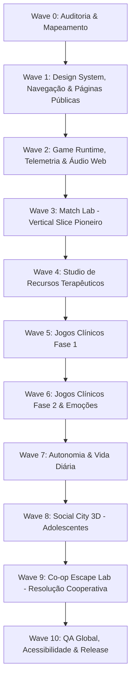

# APRUMO — MASTER IMPLEMENTATION PLAN (WAVES 0–10)

**Documento:** Plano Mestre de Implementação  
**Versão:** 2.0.0  
**Data:** Outubro de 2026  
**Status:** Aprovado para Execução Sequencial  
**Diretriz Central:** Entrega Incremental em Fatias Verticais (Vertical Slices), Zero Regressão, Acessibilidade WCAG 2.2 AA e Rigor Metodológico Clínico.

---

## 1. Princípios e Metodologia de Execução

1. **Simplicidade e Estabilidade:** Nunca quebrar contratos prévios (`@aprumo/protocol`, `@aprumo/game-sdk`, esquemas de dados Postgres). Manter a suíte de testes 100% verde após cada incremento.
2. **Design System Consistente:** Paleta acolhedora (Verde Sálvia `#3f6b67`, Creme `#faf9f6`, Terracota `#d68c71`, Lilás Denver `#6a5a98`), tipografia clara (Plus Jakarta Sans, Fraunces, Atkinson Hyperlegible, Fredoka).
3. **Touch-First & Ergonomia Móvel:** Hit areas mínimas de 44–48px para qualquer elemento clicável. Ausência de ações restritas a `:hover`.
4. **Navegação Previsível:** Nenhuma tela sem botão explícito de retorno (`BackButton`), fechar (`CloseButton`) ou migalhas de pão (`Breadcrumbs`).
5. **Decisão Clínica Humana:** *"Dados sugerem. O profissional decide."* A plataforma nunca emite diagnósticos automáticos nem escores fechados sem supervisão.

---

## 2. Roteiro Estratégico por Ondas (Waves)

---

## 3. Detalhamento das Ondas e Tarefas

### Wave 0 — Auditoria Completa e Especificações Mestres (Concluída)
- [x] Mapear todas as 26 rotas, componentes, layouts e bibliotecas existentes.
- [x] Criar `docs/APRUMO_FULL_AUDIT.md`.
- [x] Criar matriz clínica, especificação de telemetria, direção de arte e licenças.

---

### Wave 1 — Design System, Navegação Global & Páginas Públicas
**Foco:** Estabelecer a experiência do usuário de primeiro impacto (WOW visual, confiança clínica, responsividade total de 320px a 1920px) e transformar as seções da Home em páginas públicas funcionais com rotas próprias.

#### Tarefa 1.1: Componentes de Navegação & Acessibilidade em `@aprumo/ui`
- **Descrição:** Criar e exportar `BackButton`, `CloseButton`, `NextButton`, `PreviousButton`, `Breadcrumbs`, `TopNavigation`, `MobileNavigation`, `BottomNavigation`, `Tooltip` e cards padronizados (`GameCard`, `ResourceCard`). Garantir hit area ≥ 48px e foco visível.
- **Arquivos:** `packages/ui/src/components.tsx`, `packages/ui/src/components.css`, `packages/ui/src/index.ts`.
- **Critérios de Aceite:**
  - Botões interativos com mínimo de 48px de área de toque.
  - Suporte a navegação por teclado (`Enter`, `Space`, `Tab`).
  - Suporte ao `prefers-reduced-motion`.

#### Tarefa 1.2: Refinamento da TopBar & Footer Global
- **Descrição:** Atualizar o cabeçalho superior unificado e o rodapé completo nos padrões institucionais e acessíveis, com navegação responsiva (drawer móvel fluído e bottom bar contextual).
- **Arquivos:** `apps/web/src/routes/public/Landing.tsx`, `apps/web/src/routes/public/landing.css`, componentes compartilhados de layout.

#### Tarefa 1.3: Desdobramento das Seções da Home em Páginas Públicas Dedicadas
- **Descrição:** Criar rotas públicas completas com Hero própria, conteúdo especializado, CTA e rodapé, eliminando a dependência de página única:
  - `/produto` — Visão completa do ecossistema e ferramentas clínicas.
  - `/profissionais` — Para psicólogos, analistas do comportamento, terapeutas ocupacionais e supervisores.
  - `/familias` — O portal da família, transparência e generalização no ambiente doméstico.
  - `/criancas` — O ambiente sensorialmente protegido, lúdico e seguro para a infância.
  - `/adolescentes` — Autonomia, interfaces contemporâneas, graphic novel e habilidades sociais.
  - `/recursos` — O catálogo clínico do Aprumo Resource Studio.
  - `/games` — O acervo de Serious Games e jogos de aprendizagem.
  - `/como-funciona` — O ciclo clínico de 4 etapas (Planejar → Aplicar → Analisar → Decidir).
  - `/supervisao` — Fidelidade procedural, treino de aplicadores e IOA.
  - `/dados-metricas` — Rigor científico, critério duplo conservador (CDC) e alertas transparentes.
  - `/seguranca` — Conformidade LGPD, ECA Digital e prontuário imutável.
  - `/sobre` — Metodologia, história e compromisso ético.
  - `/ajuda` — Central de suporte, FAQ e tutoriais.
  - `/contato` — Canal com a equipe institucional.
- **Arquivos:** `apps/web/src/routes/public/pages/*`, `apps/web/src/main.tsx`.

---

### Wave 2 — Aprumo Game Runtime, Telemetria & Áudio Universal
**Foco:** Estabelecer o contrato definitivo entre os jogos e a plataforma.

#### Tarefa 2.1: Formalização do Game Runtime no `@aprumo/game-sdk`
- **Descrição:** Integrar o ciclo universal de eventos:
  `game_started` → `level_started` → `trial_started` → `stimulus_presented` → `prompt_presented` → `response_started` → `response_recorded` (`correct`/`incorrect`/`no_response`/`self_corrected`) → `reinforcer_presented` → `level_completed` → `game_completed`.
- **Arquivos:** `packages/game-sdk/src/client.ts`, `packages/game-sdk/src/host.ts`, `packages/protocol/src/index.ts`.

#### Tarefa 2.2: Sistema de Áudio Procedural Acolhedor (Web Audio API)
- **Descrição:** Síntese de timbres suaves (sem necessidade de carregar centenas de MP3 pesados): toque de papel, acerto suave, reforço, transição e mute global imediato.
- **Arquivos:** `packages/game-sdk/src/audio.ts`.

---

### Wave 3 — Vertical Slice Pioneiro: Match Lab
**Foco:** Elevar o jogo de pareamento existente para o padrão **Match Lab** definitivo.
- Suporte a 2, 3, 4, 6, 8 e 12 estímulos.
- Modos de resposta: Tap direto e Drag-and-drop com alternativa acessível.
- Dimensões clínicas: Idêntico, Cor, Forma, Categoria e Associação Funcional.
- Presets visuais: Soft Clay (2–5 anos), Cozy Cartoon (6–9 anos), Laboratório Clean (10+ anos).
- Telemetria de viés de posição e latência exata em milissegundos.

---

### Wave 4 — Studio de Recursos Terapêuticos Interativos
1. **Studio de Rotina Visual:** Primeiro/Depois, sequências horizontais e verticais, timer circular integrado e modo criança com foco único.
2. **Token Board Avançado:** Suporte a 1, 2, 3, 5, 8 e 10 fichas colecionáveis com 8 temas (planetas, dinossauros, trens, carros, animais, flores, formas, puzzle).
3. **Passo a Passo / Análise de Tarefa (Chaining):** Encadeamento para frente, para trás e tarefa inteira com registro de nível de ajuda.
4. **Choice & Communication Board:** Prancha de escolha com sentence strip visual e síntese de voz (TTS).
5. **Social Story Studio:** Narrativas sociais em slides com personagens consistentes.
6. **Árvore das Emoções:** Regulação somática e emocional em dois modos (Soft Clay para crianças / Graphic Novel para adolescentes).

---

### Wave 5 a Wave 9 — Expansão dos Jogos Clínicos e Ambientes 3D
- **Wave 5:** *Espelho Mágico* (imitação motora), *Olha Comigo* (atenção compartilhada), *Minha Vez / Sua Vez* (reciprocidade social), *Missão Instrução* (repertório de ouvinte em etapas).
- **Wave 6:** *MiniMundos* (sandbox funcional de brincar simbólico), *Detetive das Emoções* (pistas faciais e situacionais), *Circuito Executivo* (funções executivas: Go/No-Go, memória de trabalho).
- **Wave 7:** *Pequeno Chef* (culinária e sequenciação física), *Missão Independência* (2D isométrico: mochila, compras, mapa, autonomia urbana).
- **Wave 8:** *Social City 3D* (cenário urbano imersivo para adolescentes em Three.js/R3F com lazy-loading total).
- **Wave 9:** *Co-op Escape Lab* (desafios cooperativos a dois com física Rapier e compartilhamento de pistas).

---

### Wave 10 — QA, Testes Automatizados & Acessibilidade
- Testes Playwright automatizados nas resoluções: `390x844` (Mobile), `768x1024` (iPad), `1024x768` (Tablet Landscape), `1280x800` (Notebook), `1440x900` (Desktop).
- Validação com `@axe-core/playwright` para conformidade estrita WCAG 2.2 AA.
- Auditoria de performance com Core Web Vitals (LCP < 2.5s, CLS < 0.1, INP < 200ms).

---

## 4. Registro de Entrega — Waves 1 a 4 (04/10/2026)

- **Wave 1:** componentes de navegação em `@aprumo/ui` (Back/Close/Next/Previous, Breadcrumbs, Tooltip, GameCard/ResourceCard com botão esticado acessível), `PublicNav` + 14 páginas públicas, aliases `/recursos`, `/supervisao`, `/seguranca`.
- **Correções da auditoria (3.1–3.3):** RouteError com retorno contextual; CaseLayout com breadcrumbs, estado de caso inexistente e abas com scroll-snap; Library com "Concluir e voltar ao catálogo"; Hold-to-Exit compartilhado (1.200 ms) em ChildShell/ChildSpace/PlayShell; hit areas ≥ 44 px; SessionRunner separando "Encerrar" e layout de tablet retrato.
- **Wave 2:** eventos `LEVEL_STARTED`, `LEVEL_COMPLETED`, `STIMULUS_PRESENTED`, `RESPONSE_STARTED`, `REINFORCER_PRESENTED` (aditivos), `RUNTIME_CYCLE`, helpers no `GameClient`, `markResponseStart` no trial runner, paleta de áudio procedural (`playCue`) com mute global e desbloqueio preguiçoso. Campo máximo ampliado para 12 estímulos.
- **Wave 3:** Match Lab (appId `encontre-o-igual`): campos 1–12, dimensões idêntico/cor/forma/categoria/função, toque, arrastar e toque-toque, teclado, presets por idade, modos sensoriais e telemetria completa.
- **Wave 4 (parcial):** Quadro de Fichas com 1/2/3/5/8/10 fichas e 8 temas SVG (`TokenBoardStudio`); Studio de Rotina Visual com Primeiro→Depois, sequências horizontais/verticais, timer circular e modo criança.
- **Deploy:** `vercel.json` aponta `outputDirectory` para `apps/web/dist` com fallback SPA.
- **Pendente:** Task Analysis, Choice Board, Social Story e Árvore das Emoções (Wave 4); Waves 5–10.

## 5. Registro de Entrega — Refinamentos gerais e Wave 5 (04/10/2026)

- **Refinamentos:** landing enxuta com cartões para as páginas dedicadas; top bar com menus "Para quem" e "Recursos"; login em duas colunas (desktop) / coluna única (celular) só com Profissional e Família; entrada da criança movida para o portal da família, sem PIN (saída por toque longo de 1,2 s); sidebar profissional com rolagem própria, grupos recolhíveis e "Voltar ao site".
- **Wave 5:** *Espelho Mágico* (`espelho-magico`, imitação motora, pontuação pelo terapeuta, sem câmera); *Olha Comigo* (`olha-comigo`, atenção compartilhada com esvanecimento de pistas, sem biometria); *Missão Instrução* (appId `escolha-pela-instrucao`, níveis 1–5 com atributos, relações espaciais e 2–3 etapas); *Minha Vez / Sua Vez* com indicador de turno, `waitMs` e `offTurnTouches`.
- **Correção:** `game.html` agora dá altura total ao iframe (jogos com `height: 100%` colapsavam).

## 6. Registro de Entrega — Conclusão Integral da Wave 4 (04/10/2026)

- **Task Analysis Studio (Chaining Avançado):** Encadeamento para frente (`forward`), para trás (`backward`) e tarefa inteira (`total-task`); 4 tarefas AVD clínicas estruturadas (Lavar as Mãos, Escovar os Dentes, Calçar o Tênis, Arrumar a Mochila); hierarquia completa de dicas (`I`, `DV`, `DG`, `DFP`, `DFT`); destaque dinâmico do passo-alvo de ensino; instrução com áudio TTS (`speak`) e cálculo automático do percentual de independência com testes unitários dedicados.
- **Choice Board Studio (Prancha de Escolha Direta):** Seleção configurável de 2, 3 ou 4 opções; categorias temáticas (brinquedos, alimentos, pausas sensoriais); feedback auditivo com síntese de voz e acordes pentatônicos.
- **Communication Board Studio (PECS / CAA com Tira de Sentença):** Tira de sentença visual dinâmica com iniciadores configuráveis ("Eu quero", "Preciso de", "Eu sinto", "Eu vejo", "Vamos"); vocabulário organizado em 5 categorias temáticas; síntese de voz para leitura completa da frase montada; ações de apagar último termo e limpar tira; modo de impressão acessível.
- **Árvore das Emoções & Regulação Somática:** Dois perfis visuais dedicados (Soft Clay para 2–8 anos com árvore e ramos interativos; Graphic Novel contemporâneo para 9+ anos); 5 zonas de ativação autonômica (Verde, Amarela, Vermelha, Azul e Púrpura); 3 ferramentas de regulação somática guiada:
  1. *Respiração Compassada 4-2-4*: Círculo pulsante animado em CSS com contagem de segundos e 3 ciclos de respiração diafragmática.
  2. *Aterramento Somático 3-2-1*: Reconexão sensorial no presente (3 estímulos visuais, 2 texturas táteis, 1 som auditivo).
  3. *Estratégias Imediatas*: Acomodações sensoriais, abafador de ruídos e abraço da borboleta.
- **Testes e Integridade:** 24 testes no `@aprumo/web` (100% aprovados) e suíte completa dos 21 pacotes do monorepo verde com zero regressões.
- **Pendente:** Waves 6 a 10.

## 7. Registro de Entrega — Wave 6: Jogos Clínicos Fase 2 & Emoções (04/10/2026)

- **Detetive das Emoções (`@aprumo/game-detetive-das-emocoes`):**
  - Focado em cognição social e Teoria da Mente para faixas etárias de 6 a 15+ anos.
  - Reconhecimento de pistas faciais, microexpressões, linguagem corporal e contexto situacional em cenários clínicos (parque, sala de aula, aniversário, consultório médico, recreio e biblioteca).
  - Suporte a respostas primárias e aceitáveis (múltipla valência emocional plausível), justificativa social com feedback reflexivo e dicas progressivas (destaque de pistas faciais e pistas contextuais).
  - Telemetria clínica de tempo de reação, latência de decisão e acurácia social integrada ao `@aprumo/game-sdk`.
  - Suíte de testes unitários dedicada em `games/detetive-das-emocoes/src/logic.test.ts` (6/6 aprovados).

- **Circuito Executivo (`@aprumo/game-circuito-executivo`):**
  - Focado em funções executivas: controle inibitório (Go / No-Go), alternância de regras (Cognitive Flexibility / Task Switching) e memória operacional visuoespacial (Spatial Working Memory).
  - 3 minijogos com parâmetros calibrados por idade e perfil sensorial:
    1. *Sinal Verde, Sinal Vermelho*: Tarefa Go / No-Go com estímulos alvo/não-alvo, registro de comissões (toques em No-Go) e omissões (falha de resposta em Go).
    2. *Troca de Regra*: Alternância dimensional por cor e por forma com pista de regra explícita e medição de custo de alternância (switch cost).
    3. *Sequência Estelar*: Span de dígitos/posições visuais crescentes com reprodução para frente e reversa.
  - Suíte de testes unitários dedicada em `games/circuito-executivo/src/logic.test.ts` (4/4 aprovados).

- **MiniMundos (`@aprumo/game-minimundos`):**
  - Focado em brincar funcional, simbólico e exploração lúdica não punitiva para 3 a 11 anos.
  - 3 temas de diorama em perspectiva amigável: Casa da Família, Parque da Cidade e Consultório Amigo.
  - Itens manipuláveis com categorias de uso funcional (alimentação, descanso, transporte, higiene, brincadeira e cuidados de saúde).
  - Suporte a missões sugestivas opcionais ("Hora do lanche", "Hora do banho", "Passeio de carro", "Descanso do ursinho") sem cronômetro restritivo e sem contagem de erros, respeitando o ritmo e a agência da criança.
  - Suíte de testes unitários dedicada em `games/minimundos/src/logic.test.ts` (3/3 aprovados).

- **Integração no Web Host & Catálogo Geral:**
  - Registro dos 3 novos jogos em `apps/web/src/game-host/registry.ts`, elevando o catálogo para 14 jogos clínicos integrados.
  - Arte vetorial personalizada em SVG criada para os 3 jogos (`ArtDetective`, `ArtExecutive`, `ArtMiniWorlds`) integrada na Landing, na Biblioteca (`Library.tsx`), no Espaço da Criança (`ChildSpace.tsx`) e na página pública de catálogo (`GamesPage.tsx`).
  - Adição dos 3 novos jogos no `SPACE_ITEMS` do `CaseProfile.tsx` para liberação controlada pelo profissional de referência.
  - Teste automatizado de release gate adicionado em `apps/web/src/game-host/registry.test.ts` validando conformidade estrita com o esquema clínico `GameManifest` e carregamento dinâmico de todos os 14 jogos.
  - Testes do monorepo: **100% dos 25 pacotes aprovados** (sem falhas, sem regressões). Build de produção e PWA concluídos com sucesso.
- **Pendente:** Waves 7 a 10 (*Pequeno Chef*, *Missão Independência*, *Social City 3D*, *Co-op Escape Lab*, e E2E / A11y / Performance).

## 8. Registro de Entrega — Wave 7: Culinária Terapêutica, AVDs e Autonomia Urbana (04/10/2026)

- **Pequeno Chef (`@aprumo/game-pequeno-chef` v2.0.0):**
  - Focado em análise de tarefas, seguimento de passos sequenciais, coordenação motora e dessensibilização alimentar gradual (SOS Approach to Feeding).
  - 4 receitas estruturadas com recipientes temáticos dinâmicos:
    1. *Salada de Frutas Colorida* (Banana, Maçã, Morango, Uva, Colher de Misturar na Tigela).
    2. *Super Sanduíche Saudável* (Pão, Queijo, Folha de Alface, Rodela de Tomate, Pão de Cobertura no Prato em camadas táteis).
    3. *Mini Pizza do Chef* (Massa redonda, Molho de Tomate, Queijo Ralado, Folhas de Orégano, Forninho para Assar na Assadeira).
    4. *Vitamina Cremosa* (Leite fresco, Banana madura, Morangos, Cubo de Gelo refrescante, Liquidificador com animação de nível de líquido).
  - Arte vetorial personalizada em `Art.tsx` com 24 ilustrações culinárias exclusivas.
  - Efeitos sonoros procedurais para cada ação culinária (`plop`, `slice`, `stir`, `pour`, `sizzle`, `blender`) e narração falada (`speak`).
  - Dica embutida com pulso luminoso caso a criança hesite (`builtInPromptAfterMs`).
  - Total conformidade com o ciclo do `@aprumo/game-sdk` (`gameStarted`, `trialStarted`, `stimulusPresented`, `promptPresented`, `responseRecorded`, `gameCompleted`).
  - Testes unitários dedicados em `games/pequeno-chef/src/logic.test.ts` (3/3 aprovados).

- **Missão Independência (`@aprumo/game-missao-independencia` v2.0.0):**
  - Focado em autonomia da vida real, funções executivas, resolução de problemas cotidianos e mobilidade urbana para 4 a 16 anos.
  - 4 missões ecológicas completas com vinhetas visuais contextuais:
    1. *Missão Mochila da Escola*: Estojo com lápis, caderno de aula, garrafinha de água sem vazamento, lancheira saudável e fechamento de zíper.
    2. *Missão Mercadinho do Bairro*: Cesto de compras, maçãs da lista, leite refrigerado, esteira do caixa e conferência de troco em moedas.
    3. *Missão Ônibus e Itinerário*: Ponto de ônibus seguro, conferência do letreiro da linha (104 - Escola), validação do bilhete eletrônico, barra de apoio e acionamento da campainha de parada.
    4. *Missão Começar o Dia*: Despertar com abertura de janela, vestir roupa do dia, higiene facial e dental, café da manhã e chave na saída.
  - Arte vetorial personalizada em `Art.tsx` com 26 itens de autonomia e vinhetas contextuais em SVG para quarto, mercadinho, ponto de ônibus e saída.
  - Sons contextuais táteis (zíper, registradora de moedas, bipe de catraca, água fresca e porta).
  - Dica embutida progressiva e telemetria completa via `@aprumo/game-sdk`.
  - Testes unitários dedicados em `games/missao-independencia/src/logic.test.ts` (3/3 aprovados).

- **Integração na Plataforma & Catálogo:**
  - Ilustrações SVG em alta definição criadas na Landing (`ArtChef` e `ArtIndependence`), integradas na Biblioteca (`Library.tsx`), no Espaço da Criança (`ChildSpace.tsx`), na Página Pública de Games (`GamesPage.tsx`) e na Ficha do Caso (`CaseProfile.tsx`).
  - Release gate e testes monorepo: **100% dos 25 pacotes aprovados** (código de saída 0).
  - Build de produção e PWA concluídos com sucesso sem erros de compilação.

## 9. Registro de Entrega — Wave 8: Social City 3D (Simulação Urbana e Pragmática Social para Adolescentes) (04/10/2026)

- **Social City 3D (`@aprumo/game-social-city` v1.0.0):**
  - Focado em comunicação assertiva, pragmática, proxêmica, leitura de pistas sociais e limites interpessoais para adolescentes de 12 a 18 anos (`ageRangeMonths: [144, 216]`).
  - **Motor 3D Procedural Zero-Bloat (`renderer3d.ts`):** Projeção em perspectiva matemática personalizada no Canvas com Painter's Algorithm (ordenação de profundidade), iluminação direcional, edifícios tridimensionais (Cafeteria, Biblioteca, Estação de Ônibus, Residências), calçadas, faixas de pedestre, árvores, luminárias, bancos, ônibus e avatares animados. 100% livre de dependências pesadas, ultra-rápido, compatível nativamente com React 19 e renderização 100% offline.
  - **Navegação Urbana e Acessibilidade:**
    - Controle por teclado (`WASD` e setas direcionais), atalhos numéricos (`1-4`) e barra de espaço para interações sociais.
    - D-pad virtual sensível ao toque na tela para tablets e smartphones.
    - Atalho de aproximação/teletransporte adaptativo para acessibilidade motora reduzida.
  - **4 Cenários Sociais Ecológicos Estruturados:**
    1. *Cafeteria da Praça — Pedido de Bebida:* Interação assertiva no balcão com Sofia, praticando clareza, cumprimento cordial e civilidade.
    2. *Cafeteria da Praça — Correção de Pedido com Engano:* Expressão assertiva de insatisfação educada para substituição de item sem agressividade ou passividade.
    3. *Transporte Público — Desembarque no Ônibus Lotado:* Pedido educado de passagem com Marcos em situação de proxêmica e espaço pessoal reduzido.
    4. *Biblioteca Municipal — Apoio e Tom de Estudo:* Regulação de tom de voz e solicitação direcionada de orientação a Lúcia em ambiente compartilhado.
  - **Estilos Comunicativos com Feedback Clínico Imediato:**
    - Respostas categorizadas em *assertiva*, *passiva*, *agressiva* e *inapropriada*, pontuadas de 0 a 100 com justificativa pedagógica e reflexão social imediata.
  - **Síntese de Áudio Procedural:**
    - Web Audio API com acordes harmônicos para comunicação assertiva, sinos reflexivos para pontos de coaching e celebração final de conclusão da cidade.
  - **Telemetria Clínica e Conformidade SDK:**
    - Emissão de `SESSION_STARTED`, `TRIAL_STARTED`, `STIMULUS_PRESENTED`, `PROMPT_USED`, `TRIAL_COMPLETED`, e `SESSION_COMPLETED` via `@aprumo/game-sdk`.
  - **Suíte de Testes Unitários:**
    - `games/social-city/src/logic.test.ts` (3/3 aprovados) validando cenários, balanceamento de opções e seleção ótima.

- **Integração no Web Host & Plataforma:**
  - Registro em `apps/web/src/game-host/registry.ts`, elevando o catálogo para **15 jogos clínicos ativos**.
  - Arte vetorial personalizada `ArtSocialCity` criada em `Landing.tsx` e conectada na Biblioteca (`Library.tsx`), no Espaço da Criança (`ChildSpace.tsx`), na Página de Jogos (`GamesPage.tsx`) e na Ficha do Caso (`CaseProfile.tsx`).
  - Suíte de release gate em `apps/web/src/game-host/registry.test.ts` atualizada com timeout estendido de 15s para suportar carregamento assíncrono dos 15 jogos (4/4 aprovados).
  - Testes do monorepo: **100% dos 26 pacotes aprovados** (sem falhas, sem regressões).
  - Build de produção e PWA concluídos com sucesso.
- **Pendente:** Waves 9 a 10 (*Co-op Escape Lab* e E2E / A11y / Performance).

