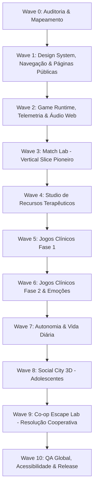

# APRUMO — MASTER IMPLEMENTATION PLAN (WAVES 0–10)

**Documento:** Plano Mestre de Implementação  
**Versão:** 2.0.0  
**Data:** Outubro de 2026  
**Status:** Aprovado para Execução Sequencial  
**Diretriz Central:** Entrega Incremental em Fatias Verticais (Vertical Slices), Zero Regressão, Acessibilidade WCAG 2.2 AA e Rigor Metodológico Clínico.

---

## 1. Princípios e Metodologia de Execução

1. **Simplicidade e Estabilidade:** Nunca quebrar contratos prévios (`@aprumo/protocol`, `@aprumo/game-sdk`, esquemas de dados Postgres). Manter a suíte de testes 100% verde após cada incremento.
2. **Design System Consistente:** Paleta acolhedora (Verde Sálvia `#3f6b67`, Creme `#faf9f6`, Terracota `#d68c71`, Lilás Denver `#6a5a98`), tipografia clara (Plus Jakarta Sans, Fraunces, Atkinson Hyperlegible, Fredoka).
3. **Touch-First & Ergonomia Móvel:** Hit areas mínimas de 44–48px para qualquer elemento clicável. Ausência de ações restritas a `:hover`.
4. **Navegação Previsível:** Nenhuma tela sem botão explícito de retorno (`BackButton`), fechar (`CloseButton`) ou migalhas de pão (`Breadcrumbs`).
5. **Decisão Clínica Humana:** *"Dados sugerem. O profissional decide."* A plataforma nunca emite diagnósticos automáticos nem escores fechados sem supervisão.

---

## 2. Roteiro Estratégico por Ondas (Waves)

---

## 3. Detalhamento das Ondas e Tarefas

### Wave 0 — Auditoria Completa e Especificações Mestres (Concluída)
- [x] Mapear todas as 26 rotas, componentes, layouts e bibliotecas existentes.
- [x] Criar `docs/APRUMO_FULL_AUDIT.md`.
- [x] Criar matriz clínica, especificação de telemetria, direção de arte e licenças.

---

### Wave 1 — Design System, Navegação Global & Páginas Públicas
**Foco:** Estabelecer a experiência do usuário de primeiro impacto (WOW visual, confiança clínica, responsividade total de 320px a 1920px) e transformar as seções da Home em páginas públicas funcionais com rotas próprias.

#### Tarefa 1.1: Componentes de Navegação & Acessibilidade em `@aprumo/ui`
- **Descrição:** Criar e exportar `BackButton`, `CloseButton`, `NextButton`, `PreviousButton`, `Breadcrumbs`, `TopNavigation`, `MobileNavigation`, `BottomNavigation`, `Tooltip` e cards padronizados (`GameCard`, `ResourceCard`). Garantir hit area ≥ 48px e foco visível.
- **Arquivos:** `packages/ui/src/components.tsx`, `packages/ui/src/components.css`, `packages/ui/src/index.ts`.
- **Critérios de Aceite:**
  - Botões interativos com mínimo de 48px de área de toque.
  - Suporte a navegação por teclado (`Enter`, `Space`, `Tab`).
  - Suporte ao `prefers-reduced-motion`.

#### Tarefa 1.2: Refinamento da TopBar & Footer Global
- **Descrição:** Atualizar o cabeçalho superior unificado e o rodapé completo nos padrões institucionais e acessíveis, com navegação responsiva (drawer móvel fluído e bottom bar contextual).
- **Arquivos:** `apps/web/src/routes/public/Landing.tsx`, `apps/web/src/routes/public/landing.css`, componentes compartilhados de layout.

#### Tarefa 1.3: Desdobramento das Seções da Home em Páginas Públicas Dedicadas
- **Descrição:** Criar rotas públicas completas com Hero própria, conteúdo especializado, CTA e rodapé, eliminando a dependência de página única:
  - `/produto` — Visão completa do ecossistema e ferramentas clínicas.
  - `/profissionais` — Para psicólogos, analistas do comportamento, terapeutas ocupacionais e supervisores.
  - `/familias` — O portal da família, transparência e generalização no ambiente doméstico.
  - `/criancas` — O ambiente sensorialmente protegido, lúdico e seguro para a infância.
  - `/adolescentes` — Autonomia, interfaces contemporâneas, graphic novel e habilidades sociais.
  - `/recursos` — O catálogo clínico do Aprumo Resource Studio.
  - `/games` — O acervo de Serious Games e jogos de aprendizagem.
  - `/como-funciona` — O ciclo clínico de 4 etapas (Planejar → Aplicar → Analisar → Decidir).
  - `/supervisao` — Fidelidade procedural, treino de aplicadores e IOA.
  - `/dados-metricas` — Rigor científico, critério duplo conservador (CDC) e alertas transparentes.
  - `/seguranca` — Conformidade LGPD, ECA Digital e prontuário imutável.
  - `/sobre` — Metodologia, história e compromisso ético.
  - `/ajuda` — Central de suporte, FAQ e tutoriais.
  - `/contato` — Canal com a equipe institucional.
- **Arquivos:** `apps/web/src/routes/public/pages/*`, `apps/web/src/main.tsx`.

---

### Wave 2 — Aprumo Game Runtime, Telemetria & Áudio Universal
**Foco:** Estabelecer o contrato definitivo entre os jogos e a plataforma.

#### Tarefa 2.1: Formalização do Game Runtime no `@aprumo/game-sdk`
- **Descrição:** Integrar o ciclo universal de eventos:
  `game_started` → `level_started` → `trial_started` → `stimulus_presented` → `prompt_presented` → `response_started` → `response_recorded` (`correct`/`incorrect`/`no_response`/`self_corrected`) → `reinforcer_presented` → `level_completed` → `game_completed`.
- **Arquivos:** `packages/game-sdk/src/client.ts`, `packages/game-sdk/src/host.ts`, `packages/protocol/src/index.ts`.

#### Tarefa 2.2: Sistema de Áudio Procedural Acolhedor (Web Audio API)
- **Descrição:** Síntese de timbres suaves (sem necessidade de carregar centenas de MP3 pesados): toque de papel, acerto suave, reforço, transição e mute global imediato.
- **Arquivos:** `packages/game-sdk/src/audio.ts`.

---

### Wave 3 — Vertical Slice Pioneiro: Match Lab
**Foco:** Elevar o jogo de pareamento existente para o padrão **Match Lab** definitivo.
- Suporte a 2, 3, 4, 6, 8 e 12 estímulos.
- Modos de resposta: Tap direto e Drag-and-drop com alternativa acessível.
- Dimensões clínicas: Idêntico, Cor, Forma, Categoria e Associação Funcional.
- Presets visuais: Soft Clay (2–5 anos), Cozy Cartoon (6–9 anos), Laboratório Clean (10+ anos).
- Telemetria de viés de posição e latência exata em milissegundos.

---

### Wave 4 — Studio de Recursos Terapêuticos Interativos
1. **Studio de Rotina Visual:** Primeiro/Depois, sequências horizontais e verticais, timer circular integrado e modo criança com foco único.
2. **Token Board Avançado:** Suporte a 1, 2, 3, 5, 8 e 10 fichas colecionáveis com 8 temas (planetas, dinossauros, trens, carros, animais, flores, formas, puzzle).
3. **Passo a Passo / Análise de Tarefa (Chaining):** Encadeamento para frente, para trás e tarefa inteira com registro de nível de ajuda.
4. **Choice & Communication Board:** Prancha de escolha com sentence strip visual e síntese de voz (TTS).
5. **Social Story Studio:** Narrativas sociais em slides com personagens consistentes.
6. **Árvore das Emoções:** Regulação somática e emocional em dois modos (Soft Clay para crianças / Graphic Novel para adolescentes).

---

### Wave 5 a Wave 9 — Expansão dos Jogos Clínicos e Ambientes 3D
- **Wave 5:** *Espelho Mágico* (imitação motora), *Olha Comigo* (atenção compartilhada), *Minha Vez / Sua Vez* (reciprocidade social), *Missão Instrução* (repertório de ouvinte em etapas).
- **Wave 6:** *MiniMundos* (sandbox funcional de brincar simbólico), *Detetive das Emoções* (pistas faciais e situacionais), *Circuito Executivo* (funções executivas: Go/No-Go, memória de trabalho).
- **Wave 7:** *Pequeno Chef* (culinária e sequenciação física), *Missão Independência* (2D isométrico: mochila, compras, mapa, autonomia urbana).
- **Wave 8:** *Social City 3D* (cenário urbano imersivo para adolescentes em Three.js/R3F com lazy-loading total).
- **Wave 9:** *Co-op Escape Lab* (desafios cooperativos a dois com física Rapier e compartilhamento de pistas).

---

### Wave 10 — QA, Testes Automatizados & Acessibilidade
- Testes Playwright automatizados nas resoluções: `390x844` (Mobile), `768x1024` (iPad), `1024x768` (Tablet Landscape), `1280x800` (Notebook), `1440x900` (Desktop).
- Validação com `@axe-core/playwright` para conformidade estrita WCAG 2.2 AA.
- Auditoria de performance com Core Web Vitals (LCP < 2.5s, CLS < 0.1, INP < 200ms).

---

## 4. Registro de Entrega — Waves 1 a 4 (04/10/2026)

- **Wave 1:** componentes de navegação em `@aprumo/ui` (Back/Close/Next/Previous, Breadcrumbs, Tooltip, GameCard/ResourceCard com botão esticado acessível), `PublicNav` + 14 páginas públicas, aliases `/recursos`, `/supervisao`, `/seguranca`.
- **Correções da auditoria (3.1–3.3):** RouteError com retorno contextual; CaseLayout com breadcrumbs, estado de caso inexistente e abas com scroll-snap; Library com "Concluir e voltar ao catálogo"; Hold-to-Exit compartilhado (1.200 ms) em ChildShell/ChildSpace/PlayShell; hit areas ≥ 44 px; SessionRunner separando "Encerrar" e layout de tablet retrato.
- **Wave 2:** eventos `LEVEL_STARTED`, `LEVEL_COMPLETED`, `STIMULUS_PRESENTED`, `RESPONSE_STARTED`, `REINFORCER_PRESENTED` (aditivos), `RUNTIME_CYCLE`, helpers no `GameClient`, `markResponseStart` no trial runner, paleta de áudio procedural (`playCue`) com mute global e desbloqueio preguiçoso. Campo máximo ampliado para 12 estímulos.
- **Wave 3:** Match Lab (appId `encontre-o-igual`): campos 1–12, dimensões idêntico/cor/forma/categoria/função, toque, arrastar e toque-toque, teclado, presets por idade, modos sensoriais e telemetria completa.
- **Wave 4 (parcial):** Quadro de Fichas com 1/2/3/5/8/10 fichas e 8 temas SVG (`TokenBoardStudio`); Studio de Rotina Visual com Primeiro→Depois, sequências horizontais/verticais, timer circular e modo criança.
- **Deploy:** `vercel.json` aponta `outputDirectory` para `apps/web/dist` com fallback SPA.
- **Pendente:** Task Analysis, Choice Board, Social Story e Árvore das Emoções (Wave 4); Waves 5–10.

## 5. Registro de Entrega — Refinamentos gerais e Wave 5 (04/10/2026)

- **Refinamentos:** landing enxuta com cartões para as páginas dedicadas; top bar com menus "Para quem" e "Recursos"; login em duas colunas (desktop) / coluna única (celular) só com Profissional e Família; entrada da criança movida para o portal da família, sem PIN (saída por toque longo de 1,2 s); sidebar profissional com rolagem própria, grupos recolhíveis e "Voltar ao site".
- **Wave 5:** *Espelho Mágico* (`espelho-magico`, imitação motora, pontuação pelo terapeuta, sem câmera); *Olha Comigo* (`olha-comigo`, atenção compartilhada com esvanecimento de pistas, sem biometria); *Missão Instrução* (appId `escolha-pela-instrucao`, níveis 1–5 com atributos, relações espaciais e 2–3 etapas); *Minha Vez / Sua Vez* com indicador de turno, `waitMs` e `offTurnTouches`.
- **Correção:** `game.html` agora dá altura total ao iframe (jogos com `height: 100%` colapsavam).

## 6. Registro de Entrega — Conclusão Integral da Wave 4 (04/10/2026)

- **Task Analysis Studio (Chaining Avançado):** Encadeamento para frente (`forward`), para trás (`backward`) e tarefa inteira (`total-task`); 4 tarefas AVD clínicas estruturadas (Lavar as Mãos, Escovar os Dentes, Calçar o Tênis, Arrumar a Mochila); hierarquia completa de dicas (`I`, `DV`, `DG`, `DFP`, `DFT`); destaque dinâmico do passo-alvo de ensino; instrução com áudio TTS (`speak`) e cálculo automático do percentual de independência com testes unitários dedicados.
- **Choice Board Studio (Prancha de Escolha Direta):** Seleção configurável de 2, 3 ou 4 opções; categorias temáticas (brinquedos, alimentos, pausas sensoriais); feedback auditivo com síntese de voz e acordes pentatônicos.
- **Communication Board Studio (PECS / CAA com Tira de Sentença):** Tira de sentença visual dinâmica com iniciadores configuráveis ("Eu quero", "Preciso de", "Eu sinto", "Eu vejo", "Vamos"); vocabulário organizado em 5 categorias temáticas; síntese de voz para leitura completa da frase montada; ações de apagar último termo e limpar tira; modo de impressão acessível.
- **Árvore das Emoções & Regulação Somática:** Dois perfis visuais dedicados (Soft Clay para 2–8 anos com árvore e ramos interativos; Graphic Novel contemporâneo para 9+ anos); 5 zonas de ativação autonômica (Verde, Amarela, Vermelha, Azul e Púrpura); 3 ferramentas de regulação somática guiada:
  1. *Respiração Compassada 4-2-4*: Círculo pulsante animado em CSS com contagem de segundos e 3 ciclos de respiração diafragmática.
  2. *Aterramento Somático 3-2-1*: Reconexão sensorial no presente (3 estímulos visuais, 2 texturas táteis, 1 som auditivo).
  3. *Estratégias Imediatas*: Acomodações sensoriais, abafador de ruídos e abraço da borboleta.
- **Testes e Integridade:** 24 testes no `@aprumo/web` (100% aprovados) e suíte completa dos 21 pacotes do monorepo verde com zero regressões.
- **Pendente:** Waves 6 a 10.
