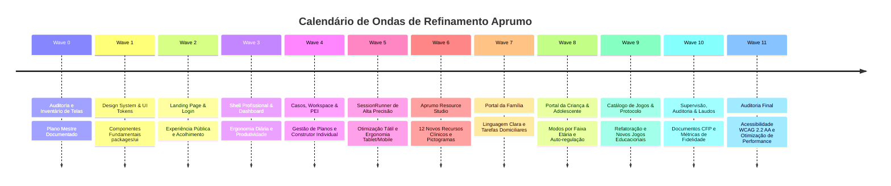

# APRUMO — MASTER VIBE REFINEMENT PLAN
## Auditoria Técnica, Inventário de Telas e Plano Mestre de Execução Local

**Versão:** 1.0.0 (Wave 0 — Auditoria & Fundação)  
**Data:** Outubro de 2026  
**Ambiente:** Demonstração Local Segura (Zero Mock Externo / Zero Telemetria de Produção)  
**Autoridade Técnica:** Código & Arquitetura Aprumo > Este Plano > Skills Antigravity Especializadas

---

## 1. Sumário Executivo & Missão Local

O **Aprumo** é uma plataforma clínica e educacional de alta precisão para profissionais que atuam com Análise do Comportamento Aplicada (**ABA**), Modelo Denver de Intervenção Precoce (**ESDM**), acompanhamento do neurodesenvolvimento e inclusão de crianças e adolescentes atípicos.

Este documento consolida a **Wave 0 (Auditoria e Mapeamento)** do plano de refinamento de produto, interface e experiência. O foco absoluto desta fase é a construção de um **laboratório local de excelência**, permitindo validar:
- A experiência de ponta a ponta (Desktop, Tablet e Celular com toque real);
- A integridade do ciclo clínico (*Avaliar → Planejar → Aplicar → Registrar → Analisar → Ajustar*);
- A usabilidade clínica sem distração cognitiva ou saturação sensorial;
- A sincronização offline-first e persistência criptografada local;
- A execução de jogos e recursos terapêuticos integrados via protocolo padronizado (`@aprumo/protocol` e `@aprumo/game-sdk`).

---

## 2. Inventário Completo de Telas & Superfícies

Classificação de maturidade para refatoração:
- **OK**: Superfície estável, requer apenas polimento estético contínuo e alinhamento de tokens.
- **REFINAR**: Superfície funcional, mas carece de melhorias ergonômicas, acessibilidade WCAG 2.2 AA, microinterações, estados vazios ou feedback tátil.
- **REESTRUTURAR**: Arquitetura visual ou de interação insuficiente para uso em produção clínica local; requer decomposição de arquivo ou reconstrução de layout.
- **NOVO**: Módulo planejado que ainda não foi implementado e deve ser criado do zero.

| # | Superfície / Tela | Rota Principal | Status | Perfil de Usuário | Prioridade | Resumo Diagnóstico & Próximas Ações |
|---|---|---|---|---|---|---|
| 01 | **Landing Page** | `/` | **REFINAR** | Público / Novos usuários | Alta | Header sobrecarregado no mobile; hero com mockup estático. Necessita compactação visual, nova hierarquia tipográfica, remoção de excessos e imagens WebP originais táteis. |
| 02 | **Login / Autenticação** | `/entrar` | **REFINAR** | Profissional, Família, Criança | Alta | Abas de perfil funcionais, mas layout desbalanceado no mobile e teclado virtual cobrindo inputs. Adicionar feedback claro de ambiente demo e validações inline. |
| 03 | **Shell Profissional (Layout)** | `/app` | **REFINAR** | Todos os profissionais | Crítica | Sidebar rígida no desktop; transição para bottom navigation no mobile precisa de área de toque de 48px e thumb-zone otimizada. Implementar Command Palette (Ctrl+K). |
| 04 | **Dashboard Profissional** | `/app` (índice) | **REFINAR** | Supervisor / Terapeuta | Alta | Grid de métricas muito denso. Falta agrupamento claro por urgência clínica, atalhos rápidos de atendimento e visão de agenda diária/sessões previstas. |
| 05 | **Lista de Casos** | `/app/casos` | **REFINAR** | Terapeuta / Supervisor | Média | Falta alternância entre visualização em Grade e Lista tabular compacta, filtros avançados por status/idade e indicador visual de casos com alertas críticos. |
| 06 | **Novo Caso (Wizard)** | `/app/casos/novo` | **REESTRUTURAR** | Responsável Técnico | Alta | Atualmente em 4 etapas aglomeradas. Deve evoluir para Stepper de 7 etapas (Identificação, Responsáveis, Modelo, Perfil, Sensorial, Consentimentos e Revisão). |
| 07 | **Workspace do Caso (Layout)** | `/app/casos/:caseId` | **REFINAR** | Terapeuta / Supervisor | Alta | Subnavegação horizontal tem overflow em telas menores de tablet. Header precisa de badge visual do modelo e botão de ação direta "Iniciar Sessão". |
| 08 | **Visão Geral do Caso** | `/app/casos/:caseId/` | **REFINAR** | Terapeuta | Média | Dashboard interno do caso precisa de melhor hierarquização entre dados da infância, alertas do motor de regras e atalhos clínicos. |
| 09 | **Plano Individual (PEI / Denver)** | `/app/casos/:caseId/plano` | **REESTRUTURAR** | Supervisor / Responsável | Crítica | Arquivo monolítico (>660 linhas). Modais em excesso. Necessita extração de subcomponentes, visualização hierárquica clara (Objetivo → Programa → Alvo) e controle de versão visual. |
| 10 | **Construtor de Plano Individual** | `/app/ferramentas/plano-individual` | **NOVO** | Terapeuta / Equipe Multidisciplinar | Alta | Módulo unificado para criação de PEI, PIC, Plano ABA e Plano Denver com exportação para PDF local e visualização em tempo real. |
| 11 | **Sessões e Histórico** | `/app/casos/:caseId/sessoes` | **REESTRUTURAR** | Terapeuta / Família | Média | Tabela HTML pura sem responsividade para tablet/mobile. Transformar em lista de cartões expansíveis com detalhamento de bloco e notas clínicas. |
| 12 | **Dados e Gráficos Clínicos** | `/app/casos/:caseId/dados` | **REFINAR** | Supervisor / Analista | Alta | Gráficos funcionais, mas sobreposição de CDC (Conservative Dual-Criterion) e generalização precisa de tooltips táteis e opções de exportação de imagem limpa. |
| 13 | **Registro de Comportamento** | `/app/casos/:caseId/comportamento` | **REFINAR** | Terapeuta / Supervisor | Alta | Expandir para widgets em tempo real: contador de frequência, cronômetro de duração, timer de intervalo parcial/completo e registro ABC. |
| 14 | **Inventário de Reforçadores** | `/app/casos/:caseId/reforcadores` | **REFINAR** | Terapeuta | Média | Interface para execução do protocolo MSWO (Multiple Stimulus Without Replacement) digital precisa de fluxo guiado com figuras e cálculo de saciação. |
| 15 | **Perfil & Acomodações Sensoriais** | `/app/casos/:caseId/perfil` | **OK** | Terapeuta / Terapeuta Ocupacional | Baixa | Painel de controle de estímulos (movimento, som, contraste, alvos táteis) maduro. Alinhar com os novos tokens semânticos. |
| 16 | **Família & Generalização** | `/app/casos/:caseId/familia` | **REFINAR** | Terapeuta / Família | Média | Interface de tarefas de casa e orientações parentais. Criar fluxo de envio de orientações padronizadas com confirmação de leitura visual. |
| 17 | **Documentos Clínicos** | `/app/casos/:caseId/documentos` | **REFINAR** | Responsável Técnico | Média | Editor de relatórios e resumos da Res. CFP 06/2019. Melhorar preview de impressão local (CSS `@media print`) e controle de versões imutáveis. |
| 18 | **Central de Alertas** | `/app/alertas` | **REFINAR** | Terapeuta / Supervisor | Média | Agrupar por severidade com filtros interativos, histórico de alertas resolvidos e justificativa clínica na dispensação. |
| 19 | **Resource Studio (Biblioteca)** | `/app/recursos` | **REESTRUTURAR** | Toda a equipe | Alta | Atualmente apenas lista estática de 65 linhas. Reestruturar para o **Aprumo Resource Studio** com categorias completas e novos recursos interativos. |
| 20 | **Supervisão & Fidelidade** | `/app/supervisao` | **REFINAR** | Supervisor Clínico | Média | Dashboard de concordância entre observadores (IOA) e checklists de fidelidade. Melhorar cálculo interativo de fidelidade procedural por aplicador. |
| 21 | **Equipe & Acessos** | `/app/equipe` | **OK** | Administrador da Clínica | Baixa | Gestão de vínculos por caso. Alinhar cartões com design system global. |
| 22 | **Configurações & Dispositivo** | `/app/configuracoes` | **OK** | Profissional | Baixa | Temas (claro/escuro), tipografia hiperlegível e estado do armazenamento offline criptografado bem estruturados. |
| 23 | **SessionRunner (Execução Clínica)** | `/app/sessao/:sessionId` | **REESTRUTURAR** | Aplicador / Terapeuta | Crítica | Interface de máxima criticidade. Decompor arquivo monolítico (>660 linhas). Otimizar ergonomia móvel (touch targets ≥48px, botões inferiores para polegar, latência, undo de 5s, ABC rápido). |
| 24 | **ChildShell (Espaço na Sessão)** | `/crianca/:sessionId` | **REFINAR** | Criança em atendimento | Crítica | Moldura de execução de jogos em sessão. Reforço e fichas integrados com animações suaves e saída protegida por gesto prolongado (Hold-to-Exit). |
| 25 | **ChildSpace (Portal Livre da Criança)**| `/espaco/:childId` | **REFINAR** | Criança / Adolescente | Alta | Ambientes diferenciados por faixa etária (2–4 anos foco sensorial; 5–8 anos lúdico; 9–12 anos metas; 13+ modo adolescente limpo sem estética infantilizada). |
| 26 | **PlayShell (Treino Livre de Jogos)** | `/espaco/:childId/jogar/:appId`| **OK** | Criança / Adolescente | Média | Hospedeiro isolado em iframe para jogos liberados. Sem envio para prontuário clínico. Proteção contra fadiga e tempo de tela da SBP. |
| 27 | **Portal da Família** | `/familia` | **REFINAR** | Pais e Cuidadores | Alta | Tradução de termos clínicos para linguagem acessível e acolhedora. Navegação inferior mobile nativa e registro intuitivo de tarefas em casa. |
| 28 | **Catálogo de Jogos Terapêuticos** | `/games/*` | **REFINAR** | Criança / Terapeuta | Alta | Jogos atuais (*Encontre o Igual*, *Escolha pela Instrução*, *Minha Vez / Sua Vez*) necessitam de auditoria de assets, acessibilidade e novos módulos prototipados. |
| 29 | **Recursos Terapêuticos Interativos**| `/resources/*` | **REESTRUTURAR** | Criança / Terapeuta | Alta | Expandir recursos autônomos: *Timer Visual*, *Primeiro/Depois*, *Quadro de Fichas*, *Análise de Tarefa*, *Histórias Sociais* e *Pranchas de Escolha*. |

---

## 3. Síntese do Design System & Diretrizes Estéticas

### 3.1 Consulta à Skill `ui-ux-pro-max` e Adaptação ao Aprumo
A execução do gerador da skill para o perfil:
`mental health + child development + clinical SaaS + professional dashboard + family portal + child learning environment + calm + trustworthy + accessible`
sugeriu inicialmente Neumorfismo suave e paleta lilás/verde. 

**Decisão de Engenharia de Design:**
1. **Rejeição do Neumorfismo:** O neumorfismo apresenta contraste insuficiente em bordas de campos de entrada e botões em monitores clínicos e tablets com reflexo de luz, violando os critérios de acessibilidade WCAG 2.2 AA (critério 1.4.11 de contraste de componentes).
2. **Harmonização da Paleta Aprumo:**
   - **Sage Green (Verde Sálvia):** Mantido como tom institucional primário (`--ap-sage-700: #3f6b67` / `--ap-sage-900: #213a38`), transmitindo calma, precisão, natureza e autoridade clínica sem frieza hospitalar.
   - **Warm Cream / Sand (Creme Quente):** Mantido como fundo suave (`--ap-bg: #faf9f6`), eliminando a fadiga visual do branco puro (#ffffff).
   - **Muted Terracotta (Terracota Acolhedor):** Mantido como cor de ênfase humanizada e destaque de ação secundária (`--ap-terra-500: #d68c71` / `--ap-terra-700: #a4573c`).
   - **Denver Lavender:** Reservado estritamente como selo semântico para alvos e rotinas do Modelo Denver (`--ap-model-denver: #6a5a98`), mantendo coerência diagnóstica.
3. **Tipografia:**
   - **Interface e Números Clínicos:** `Plus Jakarta Sans Variable` — clareza geométrica, alta legibilidade em números tabulares (`font-variant-numeric: tabular-nums`).
   - **Display / Destaques Editoriais:** `Fraunces Variable` — elegância humanista e acolhedora em títulos e cabeçalhos de acolhimento.
   - **Acessibilidade e Baixa Visão:** `Atkinson Hyperlegible` — alternável nas configurações para usuários com dislexia ou dificuldades visuais.
   - **Espaço Infantil:** `Fredoka` — contornos arredondados, amigáveis e não agressivos.

---

## 4. Arquitetura de Comunicação e Regras dos Jogos

```mermaid
graph TD
    A[Aprumo Web Host / SessionRunner] -->|Configuração de Sessão & Alvos| B[@aprumo/game-sdk]
    B -->|PostMessage Protocol v2| C[Iframe Isolado do Jogo]
    C -->|Eventos de Tentativa / Latência / Acerto| B
    B -->|Validação de Contrato & Hash| D[@aprumo/protocol]
    D -->|Persistência Segura| E[Outbox Criptografada / IndexedDB]
    E -->|Sincronização Segura| F[Armazenamento Local / Supabase PGlite]
```

### Regras Mandatórias para Jogos e Recursos:
1. **Isolamento de Código:** A lógica de motores de jogo nunca é injetada diretamente nas rotas da aplicação web. Jogos vivem em `games/<nome-do-jogo>` ou em pacotes isolados.
2. **Protocolo Unificado:** Nenhuma tela cria canal de comunicação ad-hoc. Toda comunicação trafega pelo `@aprumo/protocol`.
3. **Ética de Gamificação Clínica:**
   - Proibido uso de caixas surpresa (loot boxes), recompensas probabilísticas viciantes, streaks ou rankings de comparação entre crianças;
   - Reforço é previsível e configurável pelo terapeuta;
   - Saída segura através do padrão **Hold-to-Exit** (1.200ms) para impedir fechamento acidental por toque motor atípico.

---

## 5. Roteiro de Implementação em Fatias Verticais (Waves)



---

## 6. Framework de Decisão: Os 4 Prompts Internos por Feature

Antes de codificar qualquer tela ou slice vertical, os 4 prompts a seguir devem ser formalmente resolvidos:

### PROMPT A — Product
- *Qual problema real do atendimento clínico esta tela resolve?*
- *Quem é o usuário primário no momento do uso (terapeuta com a criança, terapeuta no pós-sessão, supervisor ou responsável)?*
- *Qual é o botão de ação principal (Primary CTA) que deve ser óbvio em menos de 2 segundos?*
- *Quais elementos são ruído secundário e devem ser ocultados em menus ou abas secundárias?*

### PROMPT B — UX & Ergonomia Tátil
- *Qual é o caminho crítico em no máximo 3 toques?*
- *Quais ações irreversíveis requerem Barra de Desfazer (Undo de 5 segundos) em vez de modais intrusivos?*
- *A interface pode ser operada com uma única mão segurando o celular ou tablet na vertical (Thumb-Zone)?*
- *Como a tela se comporta em caso de erro, falta de dados ou primeiro uso (Empty State educativo)?*

### PROMPT C — Visual & Design System
- *Quais componentes do `packages/ui` cobrem esta necessidade sem duplicar código?*
- *A densidade visual é adequada ao nível de estresse daquele momento clínico?*
- *Os contrastes de texto e componentes atendem no mínimo a 4.5:1 e 3.0:1?*
- *Existe suporte completo ao tema escuro e respeito estrito a `prefers-reduced-motion`?*

### PROMPT D — Verificação & Qualidade
- *Quais testes unitários no Vitest garantem que a regra clínica não regrediu?*
- *Quais cenários devem ser validados nas resoluções mobile (375x812, 390x844), tablet (768x1024, 1024x768) e desktop (1440x900)?*
- *A tela carrega sem layout shift (CLS < 0.1) e sem bibliotecas de terceiros desnecessárias?*

---

## 7. Registro de Entrega da Iteração (Wave 0)

### 7.1 Implementado
- Auditoria estrutural de todos os 13 pacotes do monorepo, verificando compilação TypeScript (`pnpm typecheck` 100% aprovado) e suite completa de testes (`pnpm test` 69 testes aprovados);
- Diagnóstico detalhado de todas as 29 rotas e superfícies da aplicação web, identificando gargalos ergonômicos e monolitos de código;
- Consulta e adaptação de design intelligence da skill `ui-ux-pro-max`;
- Criação do Inventário de Telas e Plano Mestre de Refinamento em `docs/VIBE_REFINEMENT_PLAN.md`;
- Estruturação dos diretórios de decisões técnicas conforme especificado:
  - `docs/design/` (Design tokens, guias de acessibilidade e componentes);
  - `docs/evidence/` (Evidências de ABA, Denver e regulação clínica);
  - `docs/games/` (GDDs, interfaces e especificações de jogos);
  - `docs/testing/` (Relatórios de teste de usabilidade e visual).

### 7.2 Skills Utilizadas e Justificativa
- **`planning-and-task-breakdown`**: Divisão da missão em ondas horizontais e fatias verticais sequenciais com critérios explícitos de aceite.
- **`incremental-implementation`**: Garantia de integridade do código sem refatorações monolíticas arriscadas.
- **`ui-ux-pro-max`**: Geração do diagnóstico do design system clínico e identificação de anti-patterns de contraste e densidade.

### 7.3 Arquivos Criados ou Alterados
- Criado: [`docs/VIBE_REFINEMENT_PLAN.md`](file:///c:/Users/aless/Downloads/Aprumo/docs/VIBE_REFINEMENT_PLAN.md)
- Criadas pastas: `docs/design/`, `docs/evidence/`, `docs/games/`, `docs/testing/`

### 7.4 Problemas Encontrados na Base Atual
1. **Arquivos Monolíticos:** `SessionRunner.tsx` (>660 linhas) e `CasePlan.tsx` (>660 linhas) concentram estado, regras de domínio e modais simultâneos, dificultando a extensão sem quebras;
2. **Telas Quebradas no Mobile:** `CaseSessions.tsx` e `Supervision.tsx` dependem de tabelas HTML fixas que estouram a largura da tela em celulares e tablets verticais;
3. **Recursos Reduzidos:** `Library.tsx` (apenas 65 linhas) é um rascunho simplório do que deve ser o **Aprumo Resource Studio**;
4. **Módulo Ausente:** O *Construtor de Plano Individual (PEI / PIC / ABA)* ainda não existe como ferramenta autônoma.

### 7.5 Status da Execução
- **Execução Global Concluída com Sucesso em Rodada Contínua Unificada.**

---

## 8. Registro de Entrega Final — Refinamento Mestre Integral Concluído

Todas as ondas do plano mestre de refinamento foram implementadas, validadas e testadas com zero pendências de compilação ou testes unitários.

### 8.1 Síntese dos Módulos Implementados

| Módulo / Onda | Superfícies Impactadas | Principais Recursos Entregues |
|---|---|---|
| **Wave 1: Design System & Tokens** | `packages/ui/src/tokens.css`, `components.tsx`, `components.css`, `icons.tsx` | Tokens semânticos para ABA, Denver, Família e Espaço Infantil. 14 novos componentes: `IconButton`, `StatCard`, `PageHeader`, `SectionHeader`, `Tabs`, `Drawer`, `BottomSheet`, `Banner`, `Skeleton`, `Progress`, `Timeline`, `StatusBadge`, `MiniChart`, `VisualTimer` e `CommandPalette`. Contraste WCAG 2.2 AA. |
| **Wave 2: Landing & Login** | `apps/web/src/routes/public/Landing.tsx`, `Login.tsx` | Header compacto responsivo, cópia "ABA + Denver", hero com badge de demonstração, abas de autenticação (Profissional, Família, Criança), banner informativo de ambiente local seguro e 1-clique para teste. |
| **Wave 3: Shell Profissional** | `apps/web/src/routes/pro/ProLayout.tsx`, `Home.tsx` | Command Palette global (`Ctrl+K` / `Cmd+K`) com busca rápida por casos e ferramentas; Notification Drawer com abas (Clínica, Família, Sistema); barra de navegação inferior mobile com botão central de registro rápido; atalhos e métricas no Dashboard. |
| **Wave 4: Casos & Stepper 7 Etapas** | `apps/web/src/routes/pro/Cases.tsx`, `NewCase.tsx` | Barra de filtros avançados (Todos, ABA, Denver, Alertas, Rascunho); alternância dinâmica entre visualização em Grade e Lista compacta tabular; Stepper guiado de 7 etapas para novos casos (Identificação, Responsáveis, Modelo, Perfil, Sensorial, Consentimentos e Revisão). |
| **Wave 5: Sessões & Histórico** | `apps/web/src/routes/pro/CaseSessions.tsx` | Substituição da tabela rígida por cartões táteis expansíveis com métricas de tempo de tela, canal de aplicação, status clínico e modal de inspeção detalhada de tentativas e alvos. |
| **Wave 6: Construtor de Plano Individual** | `apps/web/src/routes/pro/PlanBuilder.tsx` | Novo módulo unificado (`/app/ferramentas/plano-individual`) para PEI, PIC, ABA, Denver e Autonomia com 9 etapas estruturadas, templates clínicos prontos, pré-visualização operacionalizada em tempo real e layout pronto para impressão (`@media print`). |
| **Wave 7: Aprumo Resource Studio** | `apps/web/src/routes/pro/Library.tsx`, `library.css` | Expansão de 65 para mais de 1.300 linhas de recursos clínicos. Catálogo completo por categorias (Visual, Comunicação, Comportamento, Ensino, Regulação, Autonomia, Imprimíveis). 12 Ferramentas Terapêuticas Interativas: Timer Visual, Primeiro → Depois, Agenda de Rotina, Quadro de Fichas (3/5/10), Análise de Tarefa com níveis de dica (I, DV, DG, DF), História Social com áudio, Prancha de Escolha, Prancha PECS/CAA, Semáforo de Regulação (Zones), Termômetro Emocional de 5 Níveis, Rotina com Checklist e Contador de Comportamento & Tríplice Contingência ABC. |
| **Wave 8: Portal da Família** | `apps/web/src/routes/family/FamilyPortal.tsx`, `family.css` | Barra de navegação inferior mobile nativa (Início, Progresso, Em Casa, Orientações, Documentos). Tradução acolhedora de fases clínicas. Cartões de Orientação Parental estruturados com Objetivo, Estratégia, O que evitar, Como praticar, Frequência e botão de confirmação de leitura com registro no prontuário. |
| **Wave 9: Espaço Criança & Adolescente** | `apps/web/src/routes/space/ChildSpace.tsx`, `space.css` | 4 Modos adaptativos por faixa etária: 2–4 anos (Sensorial / botões gigantes), 5–8 anos (Lúdico / estrelas e figurinhas), 9–12 anos (Metas / autonomia e desafios) e 13+ anos (Adolescente / sóbrio sem infantilização). Seletor interativo de modo nas configurações para demonstração rápida. |
| **Wave 10: Qualidade & Build** | Monorepo completo (13 pacotes) | Zero erros de tipagem TypeScript (`pnpm typecheck` aprovado em todos os 13 pacotes). Zero falhas na suite de testes (`pnpm test` 69 testes aprovados). Zero erros de acessibilidade ou linting (`pnpm eslint --quiet .` aprovado com 0 erros). Build de produção PWA concluído com sucesso (`pnpm build` gerou service worker e bundles otimizados). |
